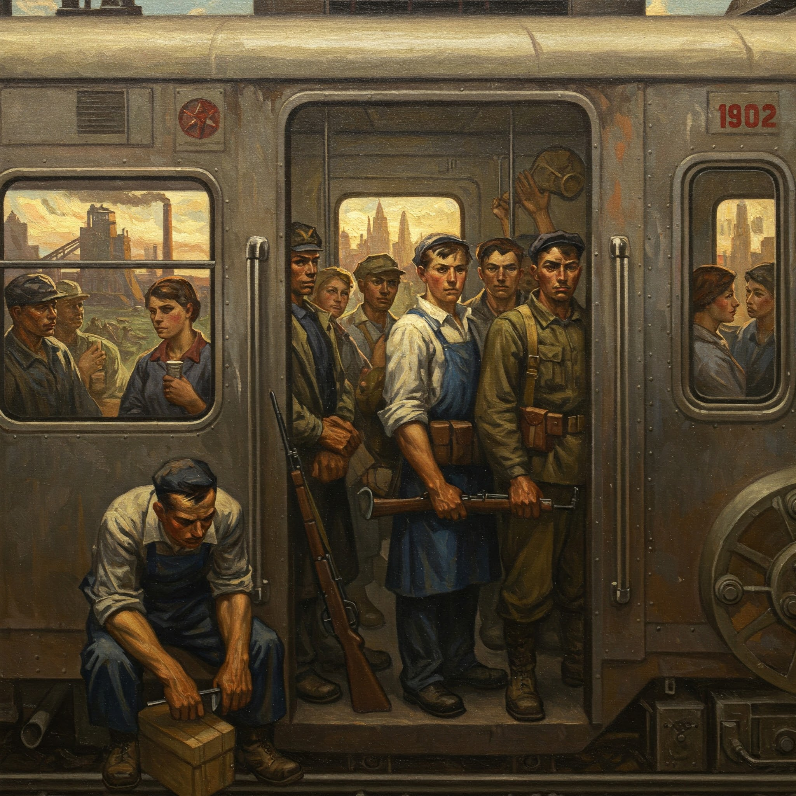

# Pintura do Realismo Socialista (IA)

## 📒 Descrição
Uso de uma IA generativa para criar uma imagem mais parecida com uma pintura com uma estética do realismo socialista.

## 🤖 Tecnologias Utilizadas
Adobe Express

## 🧐 Processo de Criação
Através de técnicas de prompt com o seguinte texto:

> Gere uma imagem no formato de uma pintura de dentro e fora do vagão de metrô, onde os passageiros são trabalhadores se preparando para a guerra. A imagem deve ter uma estética do realismo socialista e deve ter um toque de heroísmo.

## 🚀 Resultados

## 💭 Reflexão (Opcional)
O refinamento do prompt e o teste com várias IAs generativas foram os maiores desafios.